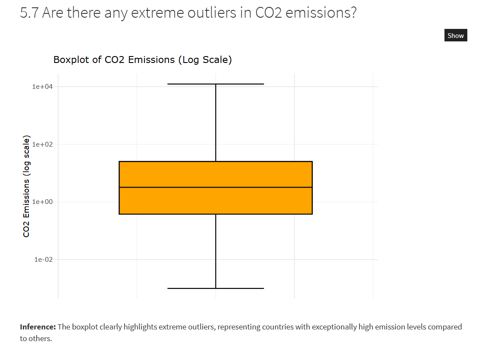
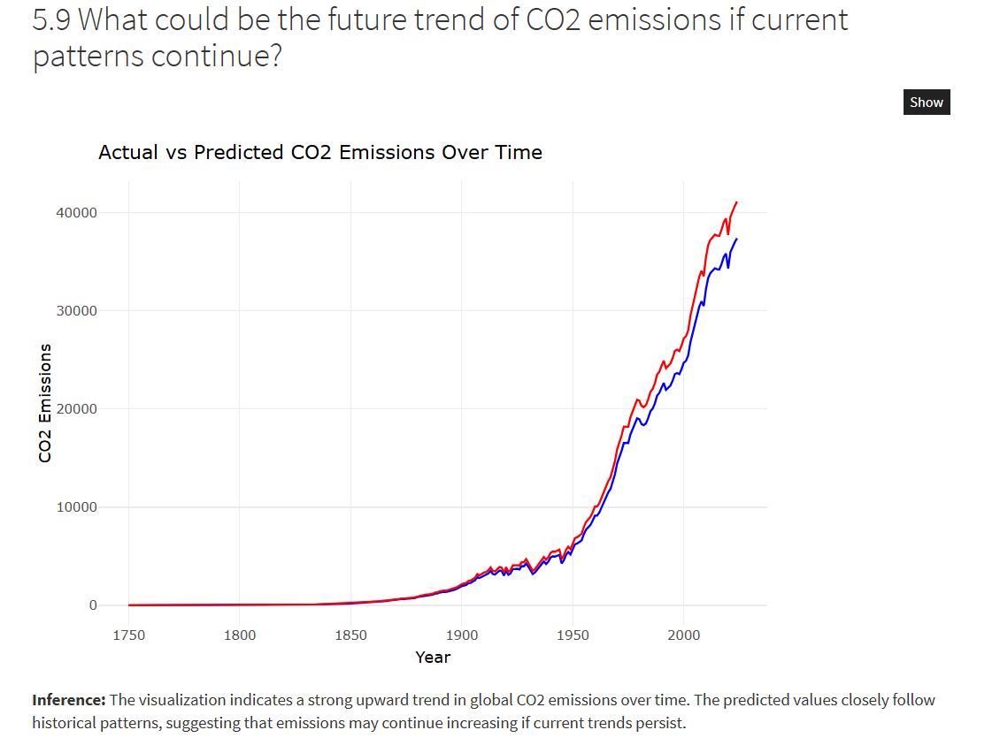
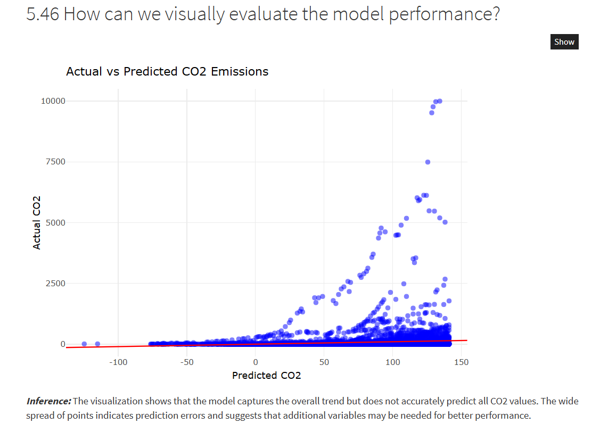

# Global Pollution Trends and Future Impact Analysis

## Overview
This project analyzes global CO2 emission trends using R programming, focusing on exploratory data analysis, visualization, regression modeling, and future emission forecasting.

## Features
- Data Cleaning
- Exploratory Data Analysis
- Data Visualization
- Correlation Analysis
- Regression Modeling
- Regression-Based Prediction Using Unseen Data

## Tools & Libraries
- R
- ggplot2
- dplyr
- caret
- tidyverse

## Dataset
Source: Our World in Data CO2 Emissions Dataset  
https://ourworldindata.org/co2-and-greenhouse-gas-emissions

## Key Insights
- Global emissions are increasing
- Emissions are unevenly distributed
- Population positively affects CO2 emissions
- CO2 emissions show strong upward growth after industrialization

## 📊 Key Visualizations

### 1️⃣ Boxplot of CO2 Emissions
This visualization highlights the distribution and variability of CO2 emissions using a logarithmic scale.

---

### 2️⃣ Future Forecasting of CO2 Emissions
This graph compares actual and predicted CO2 emissions over time, showing a rising future trend.

---

### 3️⃣ Model Performance Evaluation
This visualization compares actual and predicted values to evaluate regression model performance.

## Report

The complete interactive analysis report is available in `analysis.html`.

## Future Scope
- Advanced machine learning models
- Real-time environmental monitoring 

## Project Structure

- analysis.Rmd → Main R Markdown analysis
- analysis.html → Interactive rendered analysis report
- data.csv → Dataset used for analysis
- images/ → Visualization screenshots

## Conclusion

The analysis indicates a significant increase in global CO2 emissions over time. Statistical modeling and visualization reveal strong relationships between population growth and emissions, emphasizing the need for sustainable environmental policies.

## Live Project Links

- GitHub Repository: https://github.com/pankajydv61/Global-Pollution-Analysis-R
- GitHub Pages Website: https://pankajydv61.github.io/Global-Pollution-Analysis-R/
- RPubs Report: https://rpubs.com/Pankaj_lpu_2025/1429083
